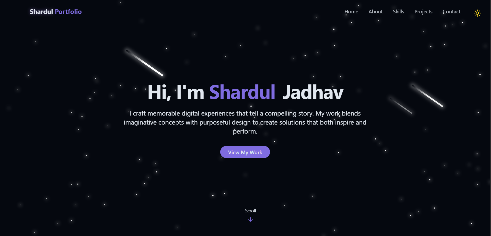

# 🌟 Personal Portfolio Website

A modern, interactive, and fully responsive **developer portfolio website** built with React and Tailwind CSS.
This project highlights personal skills, projects, and experiences in a visually appealing way with animations and effects like **starry background with shooting stars** ✨.

---

## 🚀 Features

✨ **Starry Background Animation** – Custom canvas animation with stars and shooting stars.
📱 **Fully Responsive Design** – Works seamlessly on desktop, tablet, and mobile devices.
🎨 **Modern UI/UX** – Sleek design with smooth transitions, gradients, and minimal aesthetic.
🧩 **Modular Components** – Reusable React components for easy maintenance.
📂 **Projects Showcase** – Dedicated section to highlight personal projects with details.
📜 **About & Skills Section** – Professionally structured presentation of skills and background.
📬 **Contact Form** – Integrated form for easy communication.

---

## 🛠️ Tech Stack

* **React.js** – Component-based architecture
* **Tailwind CSS** – Utility-first CSS for styling
* **Framer Motion** – For smooth animations and interactions
* **Canvas API** – Used for the custom star & shooting star background animation
* **Vite** – Fast build and development

---

## 📂 Project Structure

```bash
portfolio/
 ┣ 📂 public/            # Static assets (images, favicon, etc.)
 ┣ 📂 src/
 ┃ ┣ 📂 components/      # Reusable UI components (Navbar, Footer, etc.)
 ┃ ┣ 📂 sections/        # Main portfolio sections (Hero, About, Projects, Contact)
 ┃ ┣ 📜 App.jsx          # Root component
 ┃ ┣ 📜 index.jsx        # Entry point
 ┣ 📜 package.json       # Dependencies & project metadata
 ┣ 📜 tailwind.config.js # Tailwind configuration
 ┣ 📜 vite.config.js     # Vite configuration
```

---

## ⚙️ Installation & Setup

Clone the repository:

```bash
git clone https://github.com/your-username/portfolio.git
cd portfolio
```

Install dependencies:

```bash
npm install
```

Run locally:

```bash
npm run dev
```

Build for production:

```bash
npm run build
```

---

## 📸 Project Preview

Here’s how the portfolio looks in action:



https://responsive-portfolio-9are.vercel.app/

## 🧩 Challenges & Solutions

### Challenge:

Implementing a **star and shooting star background** without affecting performance.

### Solution:

Used the **HTML Canvas API** with `requestAnimationFrame()` for efficient rendering.
Stars were given randomized **position, size, and opacity**. Shooting stars were triggered occasionally by giving certain stars higher velocity and trails.
This created a **natural night sky effect** ✨ while keeping performance smooth.

---

## 🤝 Contributing

1. Fork the repository
2. Create your feature branch (`git checkout -b feature/new-feature`)
3. Commit your changes (`git commit -m "Add new feature"`)
4. Push to the branch (`git push origin feature/new-feature`)
5. Create a Pull Request

---

## 📜 License

This project is licensed under the **MIT License** – feel free to use and adapt it.

---

